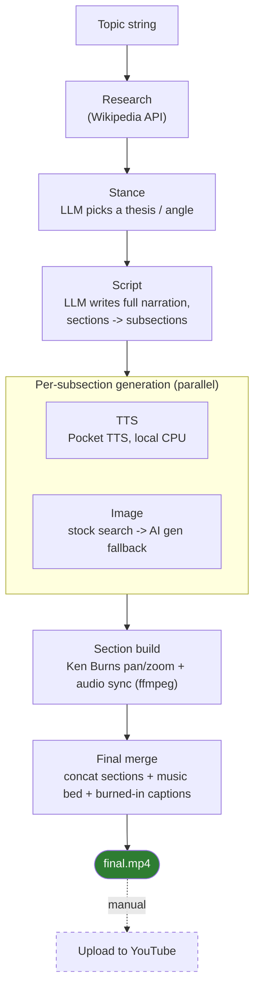
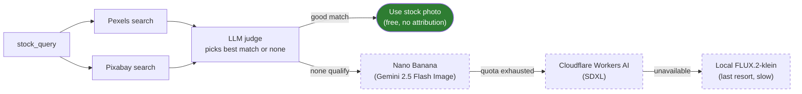
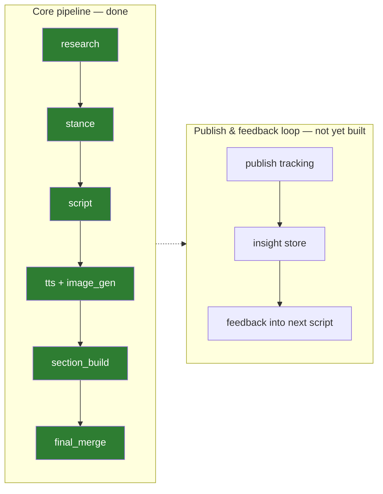

# YT Essay Gen

**Give it a topic. Get back an opinionated, narrated, captioned video essay.**

YT Essay Gen is a batch pipeline that researches a topic on Wikipedia, picks
a thesis, writes a scripted argument, generates narration and matching
visuals for every subsection, and assembles it all into a finished `.mp4` —
no manual editing required.

Full stage-by-stage design lives in [Spec.md](Spec.md); operating rules and
current build status are in [CLAUDE.md](CLAUDE.md).

## How it works



The opinion layer (`thesis`, `claim`, `evidence`) is always kept separate
from raw Wikipedia facts, so the rhetorical framing and the factual
grounding can be checked independently.

## Image generation: cheap and real before expensive and synthetic

Every subsection carries two prompts — a literal `stock_query` and an
AI-generation-style `image_prompt` — and the pipeline tries a real photo
before ever calling a generative model:



The judge weighs candidates in priority order — a real, on-topic photo beats
a generic illustration, which beats a same-era/culture "atmosphere" shot —
and only falls through to generation when nothing in the stock catalogs
clears the bar. Every image is scaled to fit the frame without cropping or
stretching; any leftover space is filled with a blurred, zoomed copy of the
same image by default (`video.image_fill_mode: blur`, or `black` for solid
letterbox/pillarbox bars).

## Background music, without the licensing headache

An LLM turns the script's title and thesis into a short mood/genre query
(e.g. "dark ambient" for a grim topic), searches the Freesound API filtered
to CC0-licensed tracks (no attribution required, ever), then a second LLM
call judges the results for tonal fit — so the bed is picked per project,
not one fixed track reused everywhere. It's loudness-normalized first
(ffmpeg `loudnorm`) so a quietly-mastered track doesn't end up inaudible,
then mixed at a fixed, audible volume under the narration
(`video.music.mode: constant` by default; `duck` sidechain-compresses it
under speech instead, for finer control). Set `video.music_bed_path` in
`config.yaml` to override with your own track; leave `FREESOUND_API_KEY`
unset to skip music entirely.

## What's built vs. what's next



Publishing itself stays manual by design — the pipeline stops at the final
`.mp4`; you upload it yourself.

## Setup

```bash
python -m venv .venv
.venv/Scripts/activate   # or: source .venv/bin/activate  (Linux/macOS)
pip install -e ".[dev]"
```

Copy [`.env.example`](.env.example) to `.env` and fill in your secrets
(Google AI Studio, Mistral, Pexels, Pixabay, Freesound are required;
Groq/Cerebras/Cloudflare are optional fallback tiers):

```bash
cp .env.example .env
```

Pipeline parameters (image-gen tiers, aspect ratio, captions, Ken Burns,
etc.) live in [`config.yaml`](config.yaml).

## Usage

| Command | Does |
|---|---|
| `pipeline new <slug> --topic "..."` | Start a new project |
| `pipeline run <slug>` | Run the pipeline end to end |
| `pipeline resume <slug>` | Resume from the last incomplete stage |
| `pipeline status <slug>` | Show per-stage progress |
| `pipeline list` | List all projects |

## Testing

TDD is the norm here — a failing test precedes every behavior change.

```bash
pytest
```

## Stack

Python 3.11+ · pydantic · Typer · httpx · ffmpeg · Wikipedia API · Mistral ·
Pexels/Pixabay · Freesound · Pocket TTS (Kyutai) · Cloudflare Workers AI ·
FLUX.2-klein
